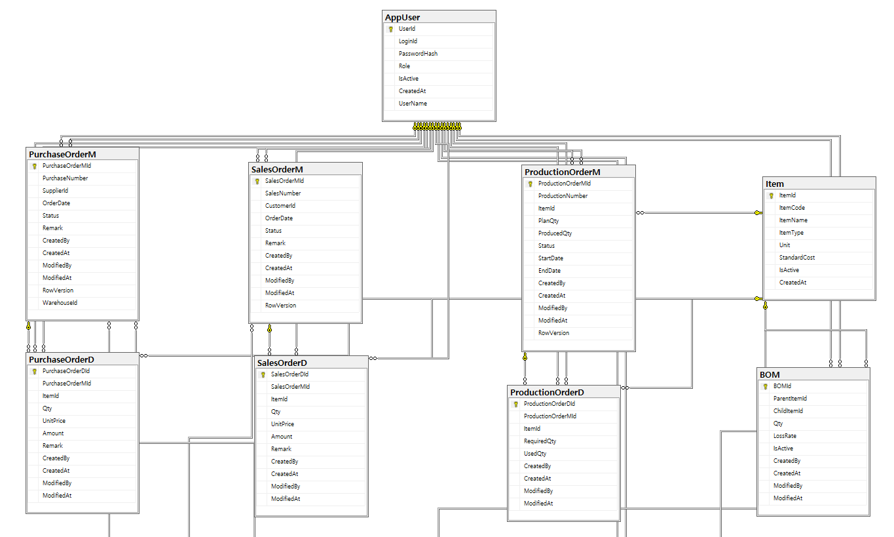
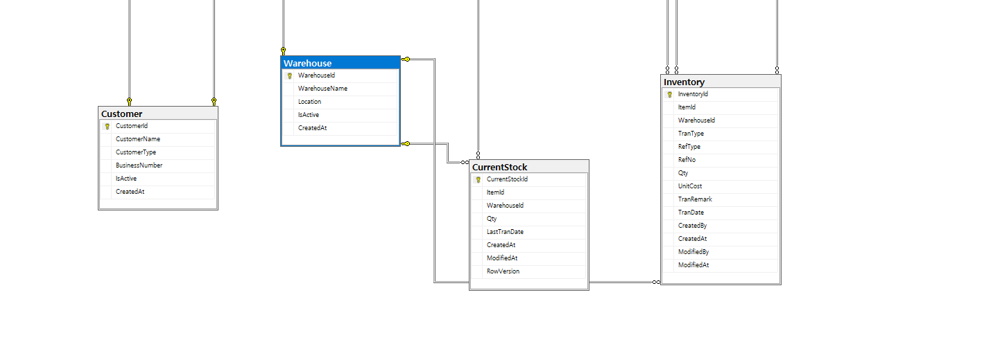
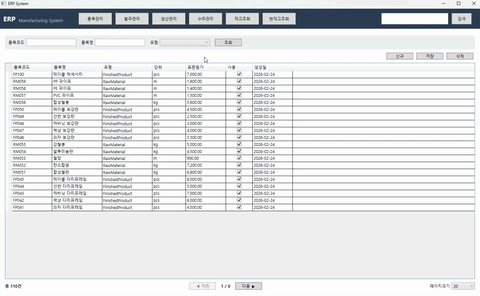
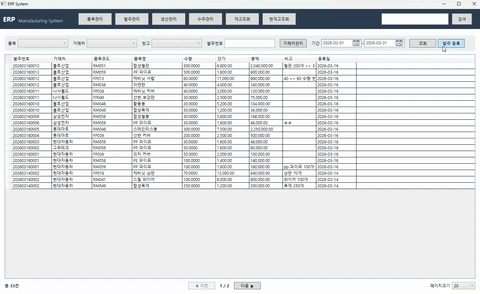

# ERP_Project

## **🗂️ 프로젝트 개요**

- **개발 기간 :** 2026.02 ~ 2026.03 (약 1개월)
- **개발 환경 :**
    - Visual Studio 2022
    - .NET 8.0 (WPF)
    - SQL Server Management Studio 20
- **사용 기술 :** C# / XAML / MS SQL Server
- **개발 형태 :** 개인 프로젝트
- **아키텍처 및 디자인 패턴 :** MVVM / Service Pattern / Dependency Injection

---

## 🎯 **프로젝트 소개**

- 제조업 ERP 시스템을 가정하여 **구매, 생산, 판매 프로세스를 데이터베이스 중심으로 설계한 개인 프로젝트**입니다.
- ERP의 핵심 업무 흐름을 반영하여 데이터 구조를 설계하고, 재고를 **Transaction 기반으로 관리**하도록 구현했습니다.
- 단순 CRUD가 아닌, **데이터 무결성과 재고 정합성 유지**를 핵심 목표로 설계하였습니다.

---

## **🧮 ERD 구조**

🔹**주요 테이블 구성**

- **기본 마스터 데이터**
    
    AppUser			- 사용자 테이블
  
    Item				- 품목 테이블
  
    Customer			- 거래처 테이블
  
    Warehouse			- 창고 테이블
    
- **구매 도메인**
    
    PurchaseOrderM	- 발주 마스터 테이블
  
    PurchaseOrderD		- 발주 디테일 테이블
    
- **생산 도메인**
    
    ProductionOrderM	- 생산 마스터 테이블
  
    ProductionOrderD	- 생산 디테일 테이블
    
- **판매 도메인**
    
    SalesOrderM		- 수주 마스터 테이블
  
    SalesOrderD		- 수주 디테일 테이블
    
- **재고 및 생산 관리**
    
    BOM				- BOM 테이블
  
    Inventory			- 재고 테이블

    CurrentStock        - 현재고 테이블
  

---

## 🎯 **시연 영상**

- **품목 관리**

- 품목/창고 **Lookup 조회 지원**
- 창고 관리 화면으로 **전환 가능**
- 조회 결과 **총 건수 표시 및 페이징 처리** (페이지 크기 조절 가능)

---

- **발주 관리**

#### 🔹발주 처리 흐름

1. **발주 등록:** 마스터/디테일 입력 후 발주 생성 (수량 및 금액 자동 계산)
2. **발주 조회:** 목록에서 더블클릭 -> 발주 상세 화면 점프
3. **발주 상세 조회:** 정보 수정 및 저장, 확정 처리(이후 수정 불가능, UI 즉시 반영)
4. **재고 반영:** 발주 등록 시 재고 데이터 생성(INSERT)
5. **현재고 갱신:** 기존 재고 수량 및 최종 거래일 갱신(UPDATE)
6. **추가 발주 처리:** 신규 발주 등록 후 동일 프로세스 반복
